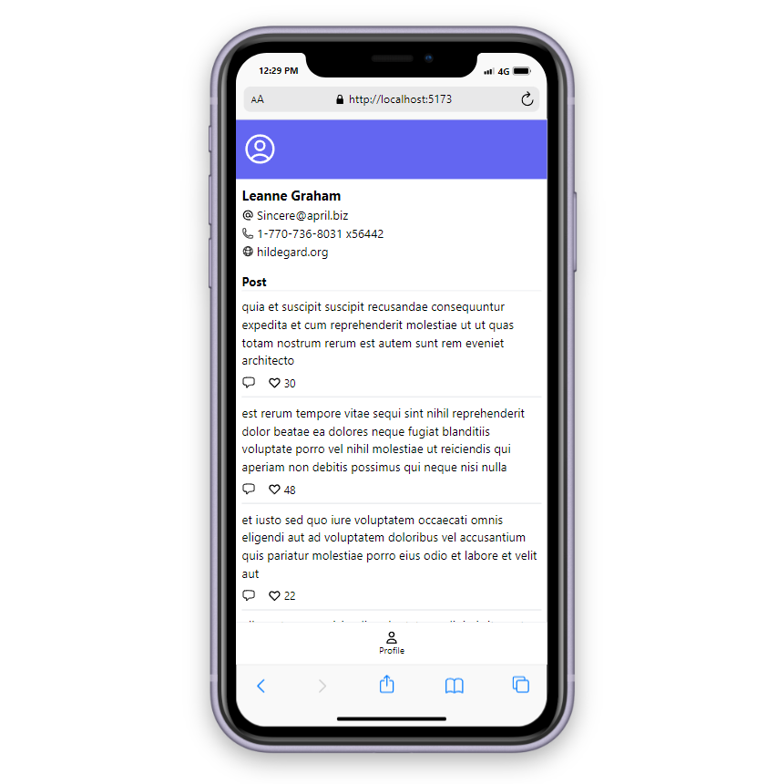

# Coding Test PT. Langgeng Inovasi Teknologi

Halaman website sederhana yang menampilkan data dari API eksternal dengan responsive design menggunakan tailwind CSS.

## Screenshot



## Tech Stacks

- React
- Tailwind CSS
- React-router-dom
- React icon

## Folder Structure

Website ini terdiri dari halaman utama (profile) dan halaman post. Komponen UI berada dalam folder components

```
src
|── components
|   |── MenuBar
|   |── Post
|   └── Profile
|── pages
|   └── PostPage
|── router
|── App.jsx
└── main.jsx
```

## API Integration

Website ini menggunakan public API [JSONPlaceholder](https://jsonplaceholder.typicode.com/). API call dilakukan menggunakan Fetch API karena mudah digunakan dan tidak membutuhkan library tambahan sehingga cocok untuk project sederhana.

Integrasi API dalam website ini memanfaatkan React Hooks berupa useState dan useEffect. useEffect dapat menjalankan fungsi data fetching ketika proses render terjadi. Selanjutnya data disimpan di dalam state menggunakan useState.

```jsx
// perubahan data disimpan dalam state
const [data, setData] = useState({});
// fetch data dari API eksternal
useEffect(() => {
  // memanggil data yang disediakan API
  fetch("API_URL")
    // mengekstrak konten dalam bentuk JSON
    .then((res) => res.json())
    // merubah state data kosong menjadi data dari API
    .then((data) => setData(data));
}, []);
```
